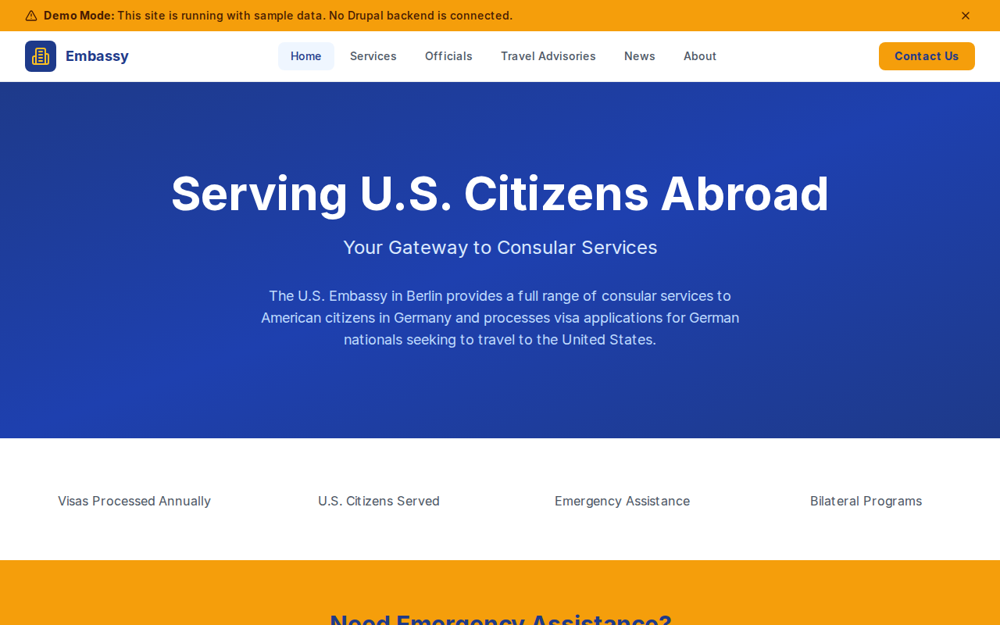

# Decoupled Embassy

A U.S. embassy website starter template for Decoupled Drupal + Next.js. Built for embassies, consulates, and diplomatic missions that need to provide consular services, travel advisories, and citizen information.



## Features

- **Consular Services** - Visa applications, passport services, notarial services, and citizen services with fees, processing times, and required documents
- **Embassy Officials** - Ambassador, deputy chief of mission, and consul general profiles with positions and contact info
- **Travel Advisories** - Country-level advisories with Level 1-4 classifications, effective dates, and safety guidance
- **News & Announcements** - Press releases, alerts, events, and policy updates with featured article support
- **Modern Design** - Clean, accessible UI optimized for government and diplomatic content

## Quick Start

### 1. Clone the template

```bash
npx degit nextagencyio/decoupled-embassy my-embassy
cd my-embassy
npm install
```

### 2. Run interactive setup

```bash
npm run setup
```

This interactive script will:
- Authenticate with Decoupled.io (opens browser)
- Create a new Drupal space
- Wait for provisioning (~90 seconds)
- Configure your `.env.local` file
- Import sample content

### 3. Start development

```bash
npm run dev
```

Visit [http://localhost:3000](http://localhost:3000)

---

## Manual Setup

<details>
<summary>Click to expand manual setup steps</summary>

### Authenticate with Decoupled.io

```bash
npx decoupled-cli@latest auth login
```

### Create a Drupal space

```bash
npx decoupled-cli@latest spaces create "My Embassy"
```

Note the space ID returned. Wait ~90 seconds for provisioning.

### Configure environment

```bash
npx decoupled-cli@latest spaces env 1234 --write .env.local
```

### Import content

```bash
npm run setup-content
```

This imports:
- Homepage with hero section, statistics, and emergency CTA
- 4 Embassy Services (Visa Applications, Passport Services, Notarial Services, U.S. Citizen Services)
- 3 Embassy Officials (Ambassador Thompson, DCM Chen, Consul General Martinez)
- 4 Travel Advisories (Germany, France, Ukraine, Turkey)
- 3 News Articles (Trade Agreement, Holiday Closure, Fulbright Exchange)
- 2 Static Pages (About, Emergency Information)
- Service categories (Visa, Passport, Notarial, Citizen Services)
- Advisory levels (Level 1 through Level 4)
- News categories (Press Releases, Alerts, Events, Policy Updates)

</details>

## Content Types

### Embassy Service
- **service_category**: Category of service (Visa, Passport, Notarial, Citizen Services)
- **processing_time**: Expected processing time
- **fee**: Service fee amount
- **required_documents**: List of required documents
- **online_url**: Online application URL
- **image**: Service image

### Embassy Official
- **position**: Title/role (Ambassador, Consul General, etc.)
- **email**: Contact email
- **phone**: Contact phone number
- **photo**: Official portrait

### Travel Advisory
- **advisory_level**: Level 1-4 classification
- **effective_date**: When the advisory took effect
- **country**: Country the advisory applies to
- **last_updated**: Date of last revision
- **image**: Advisory image

### News Article
- **image**: Featured image
- **category**: News category (Press Releases, Alerts, Events, Policy Updates)
- **featured**: Whether the article is featured

## Customization

### Colors & Branding
Edit `tailwind.config.js` to customize colors, fonts, and spacing.

### Content Structure
Modify `data/embassy-content.json` to add or change content types and sample content.

### Components
React components are in `app/components/`. Update them to match your design needs.

## Demo Mode

Demo mode allows you to showcase the application without connecting to a Drupal backend.

### Enable Demo Mode

```bash
NEXT_PUBLIC_DEMO_MODE=true
```

### Removing Demo Mode

1. Delete `lib/demo-mode.ts`
2. Delete `data/mock/` directory
3. Delete `app/components/DemoModeBanner.tsx`
4. Remove `DemoModeBanner` from `app/layout.tsx`
5. Remove demo mode checks from `app/api/graphql/route.ts`

## Deployment

### Vercel (Recommended)
[](https://vercel.com/new/clone?repository-url=https://github.com/nextagencyio/decoupled-embassy)

### Other Platforms
Works with any Node.js hosting platform that supports Next.js.

## Documentation

- [Decoupled.io Docs](https://www.decoupled.io/docs)
- [Next.js Documentation](https://nextjs.org/docs)
- [Drupal GraphQL](https://www.decoupled.io/docs/graphql)

## License

MIT
